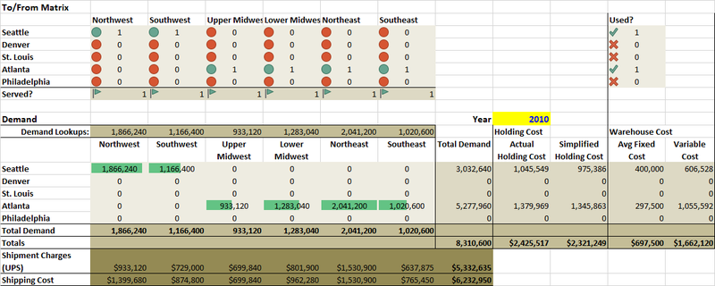

# Supply Chain Network Design - Simple Solver Model

## Solver model for case study from textbook *Supply Chain Management 5th Edition* by Sunil Chopra & Peter Meindl - Chapter 5

### [Download Excel spreadsheet w/ Solver model](SupplyChainCh5CaseStudy.xlsx) (.xlsx) - uses Solver add-in

**Provided only as a sample/reference for future students**

***

***

**Tools Used:** Excel, Solver

**Course:** DSB 6200 Supply Chain Analytics, Wayne State University

**Assignment:** Case Study

**Submitted:** April 2018

***

**Last Updated:** May 13, 2018

***

[Home](/) > [Back to MS in Data Science Coursework](/ms) >