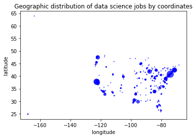
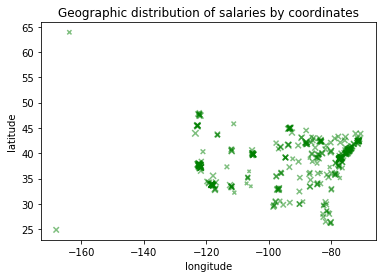
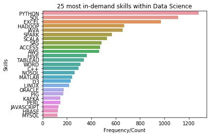

# Scraping & Analysis of Data Science Job Boards

* ## Scraping of online job portals to create our own dataset on data scientist jobs and skillsets

* ## Analysis and summary of findings based on this dataset

***

## [View Analysis & Findings here](Analysis.html)

## Questions Answered:

1. [Distribution of job titles listed within Data Science](Analysis.html#1.-What-are-the-typical-job-titles-listed-in-Data-Science?)
2. [Location of data scientist jobs](Analysis.html#2.-Where-are-data-scientist-jobs-located-the-most?-Geographical-distribution-of-jobs-in-this-segment?-(State-and-City-levels))
3. [Skills that are in high demand with employers](Analysis.html#3.-What-skills-are-in-high-demand-with-employers-in-this-segment?-What-combinations-of-skills-appear-most-often-together?)
4. [Salary range and its correlation to location](Analysis.html#4.-Salary-range-and-its-correlation-to-location-if-any.)

**Final Project - Completed with 3 of my classmates (group of 4)**

***

## Sample Findings:

*Click to enlargen*

|:-------------------|:---------------------|:---------------------|
|  |  |  |

***

**Tools Used:** Python - Pandas, Numpy, Matplotlib, Seaborn

**Course:** DSE 6000 Computational Platforms for Data Science, Wayne State University

**Assignment:** Final Project - Completed with 3 of my classmates (group of 4)

**Submitted:** Apr 25, 2018

***

**Last Updated:** May 9, 2018

***

[Home](/) > [Back to Data Science Projects](/data-science/) >

[Home](/) > [Back to MS in Data Science Coursework](/ms) >