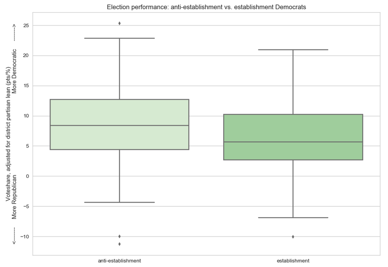

# 2018 Midterms: Did anti-establishment Democrats perform better?

> [Republicans here!](anti-establishment-republicans)

|:-----------|:-----------:|
| **Anti-establishment Democrats outperformed establishment Democrats by an average of 1.9 points** relative to their districts' partisan leans in the 2018 U.S. House general elections |  |

## However...

* **The observed effect is relatively small at just 1.9 percentage points.** 8.2 point overperformance for anti-establishment candidates (n = 60) compared to 6.3 point overperformance for establishment candidates (n = 149). Both groups significantly overperformed their districts' partisan leans.

* The effect is barely statistically significant (p = 0.049).

* **A lot depends on how one defines "anti-establishment".** Several fields in the dataset were used to categorize a candidate as "anti-establishment" or not:

    * `Yes` on any of the following fields indicated the candidate was anti-establishment: `Warren Endorsed?`, `Sanders Endorsed?`, `Our Revolution Endorsed?`, `Justice Dems Endorsed?`, `PCCC Endorsed?`, `Indivisible Endorsed?`, `WFP Endorsed?`
    * `No` on any of the following fields indicated the candidate was anti-establishment: `Biden Endorsed?`, `No Labels Support?`
    * The following fields were *not* considered indicative of establishment/anti-establishment status:
      * `Party Support?` - Political parties often throw their support behind viable candidates in competitive races (in general elections), even if the candidates don't line up completely with the party establishment.
      * `Obama Alum?` - Originally, I had thought that a candidate who previously worked in the former president's administration couldn't possibly be considered anti-establishment, but after some research, I concluded that having served in an administration does not mean one is ideologically aligned with said administration.

### What if?

If `Biden Endorsed?` were ignored, and/or `Party Support?` and/or `Obama Alum?` were considered indicative of establishment status, the observed effect becomes even smaller (closer to 1 point) *and* **the effect is no longer statistically significant. This illustrates that the effect is very small and highly dependent on how one categorizes a candidate as "establishment" or "anti-establishment".**

***

## Notes

I used [FiveThirtyEight's dataset on 2018 Democratic primary candidates](https://github.com/fivethirtyeight/data/blob/master/primary-candidates-2018/dem_candidates.csv). This dataset includes only candidates who had primary challengers, so incumbent U.S. Representatives who did not face a primary challenge were excluded from this analysis.

***

## [Data Sources](data-sources)

***

# 2018 Midterms

### [2018 Midterms: Did anti-establishment candidates really perform better?](anti-establishment-democrats)

### ["The Year of the Woman": Did candidate gender impact electoral performance?](women-candidates-emily-susan)

### [2018 Midterms: Did candidates' professional background, characteristics, and/or identities affect performance?](characteristics-democrats)

### [U.S. House: Do moderates come from swing districts? Relationship between caucus/coalition membership and district partisan lean](index)

***

**Last Updated:** Feb 8, 2019