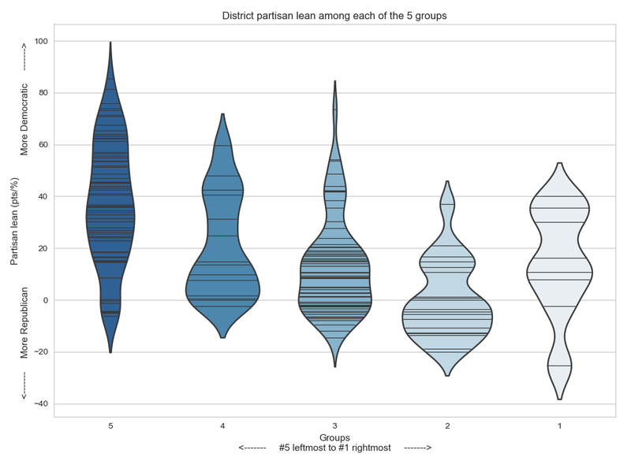
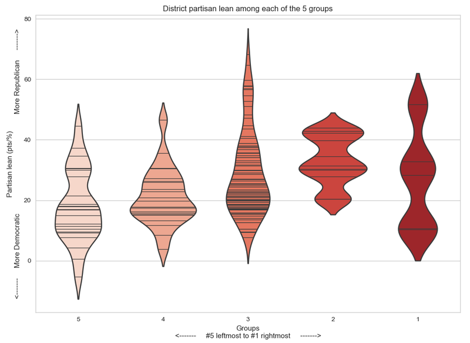
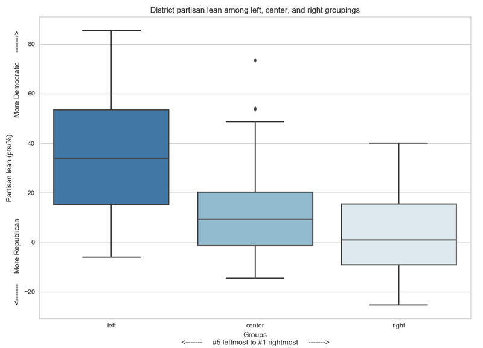
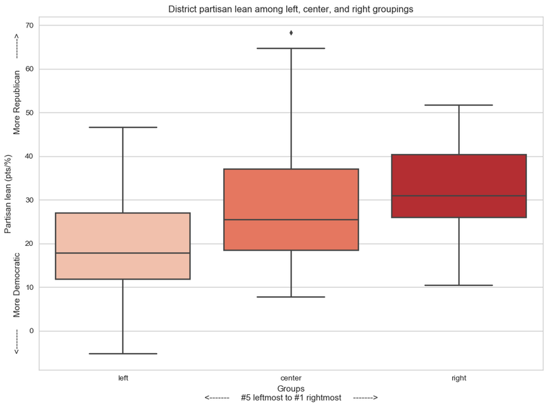

# 2018 Midterms

### [2018 Midterms: Did anti-establishment candidates really perform better?](anti-establishment-democrats)

### ["The Year of the Woman": Did candidate gender impact electoral performance?](women-candidates-emily-susan)

### [2018 Midterms: Did candidates' professional background, characteristics, and/or identities affect performance?](characteristics-democrats)

### [U.S. House: Do moderates come from swing districts? Relationship between caucus/coalition membership and district partisan lean](index)

***

# U.S. House: Do moderates come from swing districts? Relationship between caucus/coalition membership and district partisan lean

|  |  |

## Democratic Coalitions

* `3` [Congressional Progressive Caucus](https://cpc-grijalva.house.gov/index.cfm?sectionid=71&sectiontree=2,71)
* `2` [New Democrat Coalition](https://newdemocratcoalition-himes.house.gov/members-text-only-version)
* `1` [Blue Dog Caucus](https://bluedogcaucus-costa.house.gov/members)

## Republican Coalitions

* `3` [Main Street Partnership](https://republicanmainstreet.org/members/)
  * [Tuesday Group](https://ballotpedia.org/Tuesday_Group) - According to Ballotpedia, "The Tuesday Group does not have an official membership list." I was not able to locate one either. Thus, the Tuesday Group was excluded from this analysis, with the exception of co-chairs Elise Stefanik, Charlie Dent, and John Katko, whose names are known. They were added to coalition `3`.
* `2` [Republican Study Committee](https://rsc-johnson.house.gov/about/membership)
* `1` [Freedom Caucus](https://ballotpedia.org/House_Freedom_Caucus) - According to Ballotpedia, "The House Freedom Caucus does not have an official membership list. As of February 2018, caucus membership was estimated at 36 members." I wasn't able to find an official list either, so the list of known members (via Ballotpedia) was used in this analysis.

***

## Subgroups

Within each party, coalition `3` is the leftmost and coalition `1` is the rightmost.

Representatives can belong to more than one coalition. So I created 5 groups for each party. Within their party, Reps can belong to

1. only coalition `1`,
2. coalitions `1`&`2`,
3. only coalition `2`,
4. coalitions `2`&`3`,
5. or only coalition `3`,

for a total of 5 groups per party. Within each party, group #5 is the leftmost and group #1 is the rightmost. (No Rep belonged to both coalition `1` and coalition `3`! i.e. No Rep belonged to both the Main Street Partnership *and* the Freedom Caucus, or to both the Blue Dog Caucus *and* the Congressional Progressive Caucus!)

***

## Average district partisan lean among the 5 groups

### Democrats

Only 177 of 234 Democratic Reps could be categorized by coalition membership. Some Reps are not in any of the three coalitions and because some Reps' names were not an exact match across lists. (I tried to get as many exact matches as possible by removing hyphens, replacing accented characters with non-accented ones, using nicknames, removing/adding suffixes and middle initials, etc.)

| Group | District Partisan Lean (Mean ± St Dev) | # of Reps (n) |
| --- | ----------- | ----- |
| All | 22.6 ± 24.4 | 177 |
| 5 (leftmost) | 37.2 ± 23.3 | 75 |
| 4 | 20.9 ± 19.6 | 14 |
| 3 | 13.2 ± 18.5 | 61 |
| 2 | 0.3 ± 14.7 | 19 |
| 1 (rightmost) | 14.1 ± 20.2 | 8 |

### Republicans

Only 146 of 201 Republican Reps could be categorized by coalition membership, for the same reasons as above.

| Group | District Partisan Lean (Mean ± St Dev) | # of Reps (n) |
| --- | ----------- | ----- |
| All | 26.2 ± 13.7 | 146 |
| 5 (leftmost) | 17.9 ± 11.9 | 24 |
| 4 | 21.0 ± 9.3 | 22 |
| 3 | 29.0 ± 14.1 | 84 |
| 2 | 33.1 ± 8.0 | 11 |
| 1 (rightmost) | 26.8 ± 15.4 | 5 |

The large standard deviations indicate that each grouping, and each caucus, represents districts with widely differing partisan leans.

***

## Average district partisan lean among left, center, and right groupings

Regrouping to compare only left flank vs. right flank, groups 4&5 form the left flank and groups 1&2 form the right flank. Group 3 constitutes the center.

### Democrats

|:-----------:|:-----------:|
|  | * The districts the left flank represents are **30 points bluer** (more Democratic-leaning) than the districts the right flank represents (p < 0.000).  * Likewise, the districts the left flank represents are **21 points bluer** than the districts the center flank represents (p < 0.000).  * The center represents districts **9 points bluer** than the right flank does (p = 0.041). |

| New Group | District Partisan Lean (Mean ± St Dev) | # of Reps (n) |
| --- | ----------- | ----- |
| Right | 4.4 ± 17.7 | 27 |
| Center | 13.2 ± 18.5 | 61 |
| Left | 34.6 ± 23.5 | 89 |

### Republicans

|:-----------:|:-----------:|
| * The districts the right flank represents are **12 points redder** (more Republican-leaning) than the districts the left flank represents (p = 0.001).  * Likewise, the districts the center flank represents are **10 points redder** than the districts the left flank represents (p < 0.000). |  |

| New Group | District Partisan Lean (Mean ± St Dev) | # of Reps (n) |
| --- | ----------- | ----- |
| Right | 31.1 ± 11.3 | 16 |
| Center | 29.0 ± 14.1 | 84 |
| Left | 19.4 ± 10.9 | 46 |

The right flank does *not* represent districts redder (or bluer) than the center does (p = 0.584). (The reason this last one is significant for the Democrats but not for the Republicans is simply that there are more Democratic Reps than Republican Reps in the 116th U.S. House.)

***

## [Data Sources](data-sources)

***

# 2018 Midterms

### [2018 Midterms: Did anti-establishment candidates really perform better?](anti-establishment-democrats)

### ["The Year of the Woman": Did candidate gender impact electoral performance?](women-candidates-emily-susan)

### [2018 Midterms: Did candidates' professional background, characteristics, and/or identities affect performance?](characteristics-democrats)

### [U.S. House: Do moderates come from swing districts? Relationship between caucus/coalition membership and district partisan lean](index)

***

**Last Updated:** Feb 15, 2019