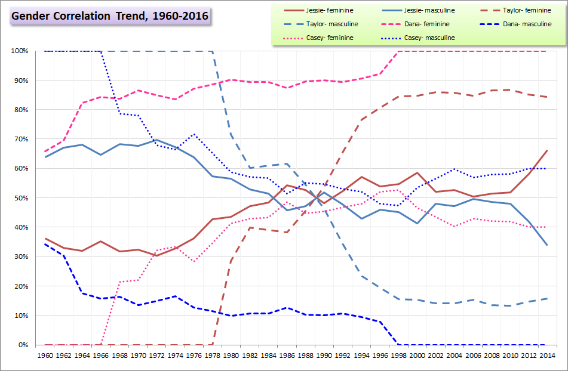
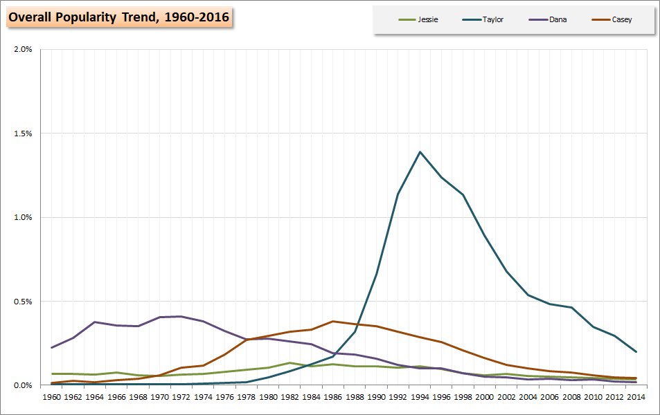
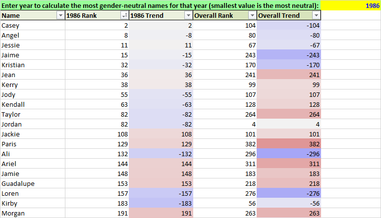

# Name Trender: trends popularity & gender correlation of names

### This Excel tool trends year-by-year popularity and gender correlation of given (first) names using publicly available US government data from the Social Security Administration. Useful for writers, parents-to-be, new names, pseudonyms, etc.

***

## [Download Excel spreadsheet](NameTrenderUpload.xlsx) (.xlsx) - preferred

## [Check it out on Google Sheets!](https://docs.google.com/spreadsheets/d/1rswNzKmrvqvopxq0AzBfakaSuRcR1Jhru-6UhUBjX0Q/edit?usp=sharing)

***

## Screenshots:

*Click to enlargen*

|:------|:------|:------|:------|
 |  |  |  |

* On main (1st) sheet, enter up to 4 names of interest in the yellow cells (in row 4)
  * Scroll down to look at year-by-year popularity and gender trends

* *MostNeutralByYear* (2nd sheet) calculates the most gender-neutral names for a given birth year.

* Don't make changes to *Data* and *Pivot* - these sheets contain the underlying data the other sheets rely on 

Uses United States Social Security Administration data [publicly available from SSA.gov](http://www.ssa.gov/OACT/babynames/index.html). Years 1960 to present. Uses even years only. (Using all years made for sluggish calculations.)

***

**Last Updated:** May 10, 2018
