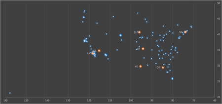
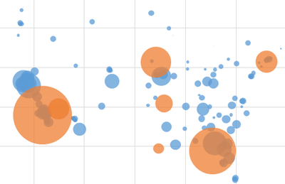

# Supply Chain Network Design Case Study

## Found optimal network configuration for highly constrained network

### Project Summary:

* Determined optimal network configuration for unconstrained scenario, plus two more scenarios with network constraints and pressures.

* Compared optimal network configuration costs to calculated baseline (current-state) costs.

* Our model reduced network costs by 45%, for a savings of $59 million!

* Made data-driven business recommendations based on our findings.

### Files:

* ### [View Final Report here](TermProjectReportUpload.html)

* ### [Download Excel spreadsheet w/ Solver model](ExcelModelUpload.xlsx) (.xlsx)
  * **[Preview only](ExcelModelUpload.html)** (.html) - does not render perfectly
  * Uses Solver, [OpenSolver](https://opensolver.org/) - due to large number of variables, doesn't work with built-in Solver

* **[GroupBy.html](GroupBy.html)** and **[Q10-Revenue.html](Q10-Revenue.html)**
  * HTML outputs. Used Python (Pandas, Numpy) to prep data

***

### Sample Findings:

Map of customers (blue) and DCs (orange) [(More)](TermProjectReportUpload.html#_Toc513676387)

***

[Our model reduced network costs by 45%, for a savings of $59 million!](TermProjectReportUpload.html#_Toc513676393)

***

By allowing for split quantities, i.e. relaxing binary constraints on Decision Variables, our model allowed all customers to be served and all demand to be met - even when distribution centers had limited capacity, three distribution centers were closed, and total network demand was increased by 15%. [(More)](TermProjectReportUpload.html#_Toc513676399)

***

**Tools Used:** Regex, Python (Pandas, Numpy), Excel, Solver, [OpenSolver](https://opensolver.org/)

**Course:** DSB 6200 Supply Chain Analytics, Wayne State University

**Assignment:** Final Term Project (XRetailer Supply Chain Network Design Problem Case Study)

**Submitted:** May 7, 2018

***

**Last Updated:** May 9, 2018

***

[Home](/) > [Back to Data Science Projects](/ms-coursework/) >

[Home](/) > [Back to MS in Data Science Coursework](/ms) >