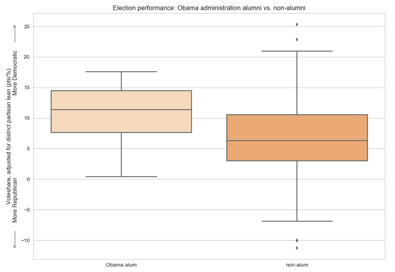

# 2018 Midterms: Did candidates' professional background, characteristics, and/or identities affect performance?

> [Republicans here!](anti-establishment-republicans)

## Democrats

### Professional Background

| Characteristic | Overperformance |
| -------------------------- | ---- |
| Obama alum | 10.6% |
| Held elected office before | 8.9% |
| Veteran | None |
| Party support | None |

|:-----------:|:-----------|
|  | **Democrats who worked in President Obama's administration outperformed those who didn't.** |

In the 2018 U.S. House general elections, Obama alumni overperformed by a whopping **10.6 percentage points** relative to their districts' partisan leans, while non-alumni overperformed by a more modest 6.7 points, making for a **3.9-point outperformance by Obama alumni over non-alumni** (p = 0.036, n = 12 Obama alumni of 209 total candidates).

Relatedly, **Democrats who had held elected office before (at any time and at any level) outperformed those who hadn't by 2.4 points** (p = 0.04). Candidates who had held elected office before (n = 35) overperformed their districts' partisan leans by 8.9 points, while those who hadn't (n = 174) overperformed by 6.5 points.

Surprisingly, being a veteran/having served in the armed forces did *not* correlate to electoral performance! (31 candidates in the dataset are veterans; 178 are not.)

Also surprisingly, candidates with party support didn't perform better (or worse) than candidates without party support. (36 candidates were explicitly identified as having party support; 173 were not.)

### Personal Characteristics

**No relationship between a candidate's race and his/her performance** in 2018 U.S. House elections relative to their district's partisan lean (n = 159 white candidates, n = 50 nonwhite candidates)

**No relationship between a candidate's LGBTQ identification and his/her performance** (n = 201 non-LGBTQ candidates, n = 8 openly LGBTQ candidates)

***

## Notes

I used [FiveThirtyEight's dataset on 2018 Democratic primary candidates](https://github.com/fivethirtyeight/data/blob/master/primary-candidates-2018/dem_candidates.csv). This dataset includes only candidates who had primary challengers.

It's possible that some candidates may have won or lost primaries in part because of their professional background, race, or sexual orientation - so it's possible that professional background or personal characteristics impact which candidates voters select at the primary level, before they can reach the general election.

***

## [Data Sources](data-sources)

***

# 2018 Midterms

### [2018 Midterms: Did anti-establishment candidates really perform better?](anti-establishment-democrats)

### ["The Year of the Woman": Did candidate gender impact electoral performance?](women-candidates-emily-susan)

### [2018 Midterms: Did candidates' professional background, characteristics, and/or identities affect performance?](characteristics-democrats)

### [U.S. House: Do moderates come from swing districts? Relationship between caucus/coalition membership and district partisan lean](index)

***

**Last Updated:** Feb 8, 2019