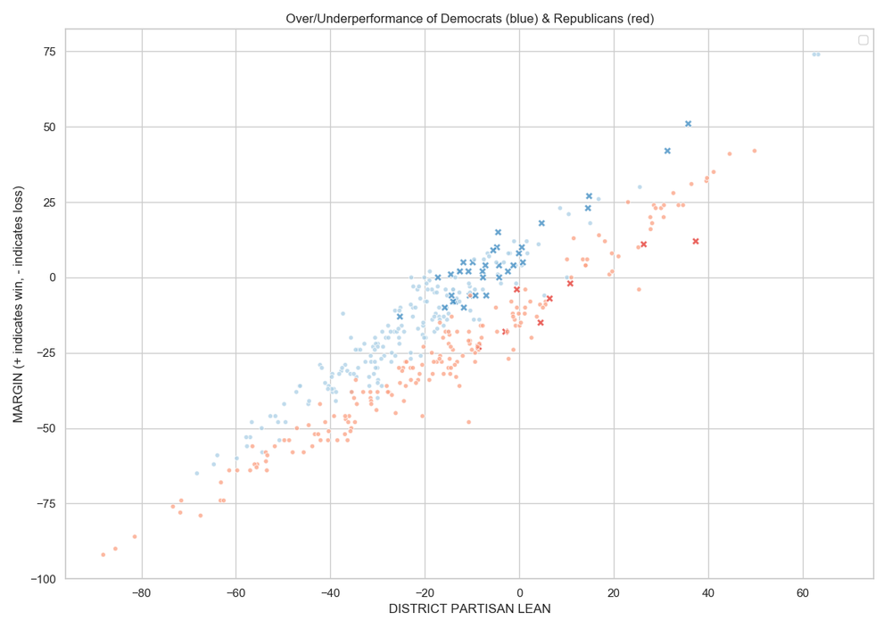
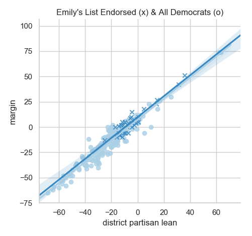
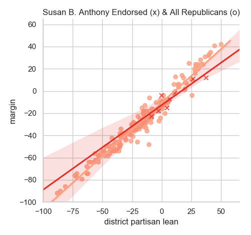
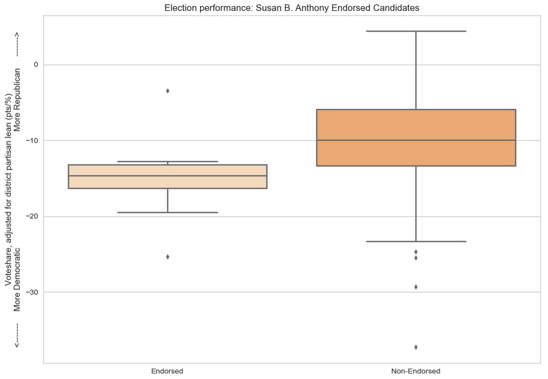
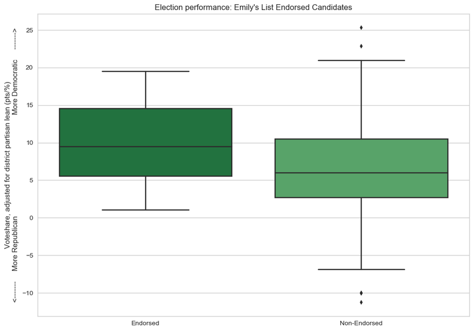

# 2018 Midterms: Was 2018 "the Year of the Woman"? Did candidate gender impact performance?

## Democratic women endorsed by Emily's List & Republican women endorsed by Susan B. Anthony List

**Among candidates for U.S. House seats in the 2018 general elections:**

* ### `Emily`-endorsed Democratic women meaningfully overperformed other members of their party, and

* ### `Susan`-endorsed Republican women well *under*performed other members of their party.

**Democrats overperformed (held higher voteshare margins) and Republicans underperformed (held lower voteshare margins)** relative to the partisan leans of the districts they ran in.

* `x` are women candidates endorsed by the named organizations
* `o` are all other Democrats (blue) and Republicans (red).

|:-----------:|:-----------:|
|  |  |

[Neither dataset I used has candidates' genders](https://github.com/fivethirtyeight/data/blob/master/primary-candidates-2018/), so **I compared Democratic candidates endorsed by *Emily's List*** (`Emily Endorsed?`) **and Republican candidates endorsed by the *Susan B. Anthony List*** (`Susan B. Anthony Endorsed?`). **Both organizations endorse *only* women, but not *all* women from their preferred parties, so this method is only a very approximate proxy for candidate gender.** Plenty of women candidates were endorsed by neither organization.

***

### Republicans

|:-----------:|:-----------|
|  | `Susan`-endorsed candidates performed poorly - the effect is statistically significant despite the very small sample size (n = 8) |

| Group | Performance | n |
| -------------------------- | ---- | ---- |
| `Susan`-endorsed candidates | -14.9% | 8 |
| All Republican candidates | -9.9% | 181 |

`Susan`-endorsed Republicans underperformed by -5% (p = 0.018) - compared to Republicans not endorsed by the organization

***

### Democrats

|:-----------|:-----------:|
| **`Emily`-endorsed candidates far overperformed those not endorsed by the organization** |  |

| Group | Performance | n |
| -------------------------- | ---- | ---- |
| `Emily`-endorsed candidates | +9.8% | 33 |
| All Democratic candidates | +6.3% | 176 |

`Emily`-endorsed Democrats overperformed by +3.5% (p = 0.004) - compared to Democrats not endorsed by the organization

***

## Notes

I used [FiveThirtyEight's dataset on 2018 primary candidates](https://github.com/fivethirtyeight/data/blob/master/primary-candidates-2018/) and only included candidates who won their primaries and advanced to their respective general elections. This dataset includes only candidates who had primary challengers. Moreover, I only looked at candidates for U.S. Representative/House seats (no U.S. Senators or state-level candidates).

As the above findings could be caused by several factors, and correlation does not equal causation, one should *not* draw the conclusion that a `Susan` endorsement tanked a candidate or that an `Emily` endorsement helped a candidate to victory. It could also be, for example, that `Susan` made "riskier" endorsements, perhaps endorsing candidates that were very likely to lose, while `Emily` made safer endorsements. But still, this is not a conclusion that can be drawn directly from this analysis.

***

## [Data Sources](data-sources)

***

# 2018 Midterms

### [2018 Midterms: Did anti-establishment candidates really perform better?](anti-establishment-democrats)

### ["The Year of the Woman": Did candidate gender impact electoral performance?](women-candidates-emily-susan)

### [2018 Midterms: Did candidates' professional background, characteristics, and/or identities affect performance?](characteristics-democrats)

### [U.S. House: Do moderates come from swing districts? Relationship between caucus/coalition membership and district partisan lean](index)

***

**Last Updated:** Feb 16, 2019