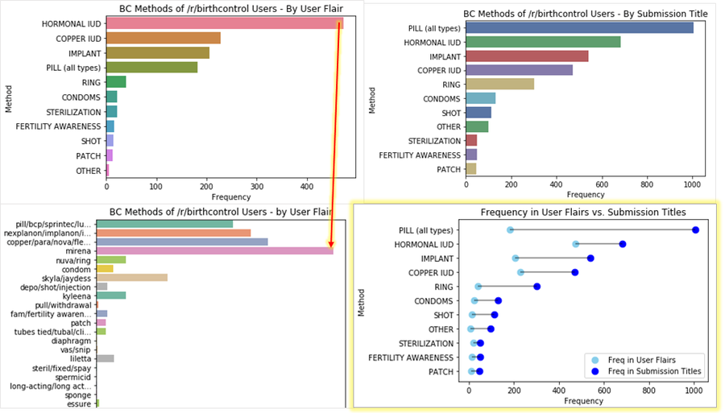
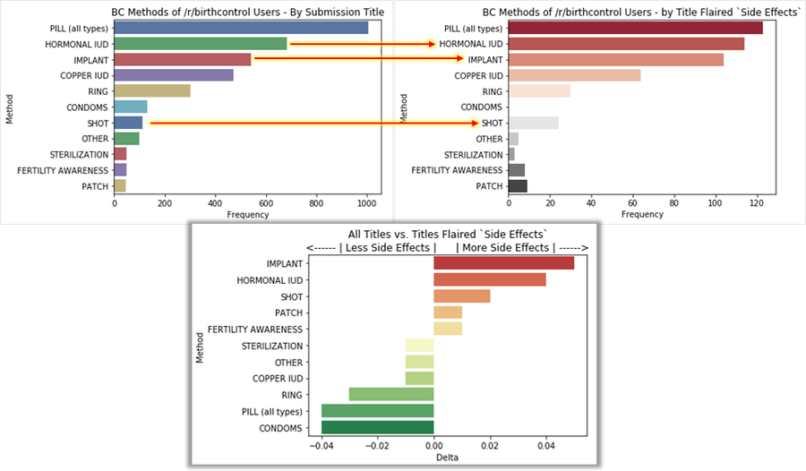
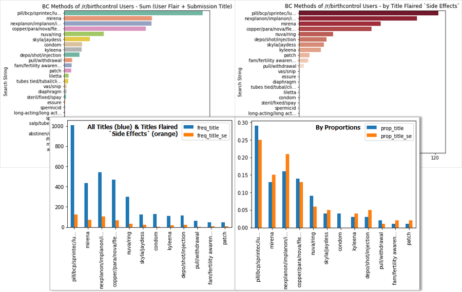

# Popularity of Birth Control Methods on Reddit & Reported Side Effects

***

## Intro

### Questions

**1)** What is the distribution of birth control methods among user flairs of /r/birthcontrol users? (Also referred to as author/Redditor flairs)

**2)** What is the distribution of birth control methods mentioned in submission titles?

**3)** Is there a difference in the distribution of birth control methods between user flairs and submission titles?

**4)** What is the distribution of birth control methods among titles of submissions flaired `Side Effects`?

**5)** Are some methods over- or underrepresented among titles of submissions flaired `Side Effects` compared to the overall sample of titles? i.e. It may be possible to say that users of xyz methods are disproportionately likely to post about side effects.

### [Process - view details](process)

It is important to note that any conclusions cannot be extrapolated outside the user base of /r/birthcontrol and even less so outside of Reddit altogether.

### Hypotheses

**Among user flairs:** Reddit tends younger and more educated. Especially, users who visit /r/birthcontrol regularly enough to have flairs are probably more highly educated than average about birth control options. I would predict - purely intuitively - that such users are more likely to prefer IUDs and implants.

**Among submission titles:** I would expect submission titles to reflect a wider pool of Redditors - still highly selected, but not as selected as the pool of users who visit /r/birthcontrol regularly enough to have flairs. I would expect a more typical distribution among submission titles, in which various pill/oral contraceptive types are mentioned most often.

***

## Analysis

### Frequency Distribution by Method (Q1 & Q2)

| **METHOD** | **User Flairs** | **Submission Titles** | **Submissions Flaired `Side Effects`** | **Proportion of Side Effects** |
| ------------- | ---- | ---- | ---- | ----------------- |
| PILL (all types) | 182 | 1006 | 123 | 25% |
| HORMONAL IUD | 474 | 683 | 114 | 24% |
| IMPLANT | 206 | 541 | 104 | 21% |
| COPPER IUD | 228 | 471 | 64 | 13% |
| RING | 39 | 300 | 30 | 6% |
| CONDOMS | 22 | 130 | 1 | 0% |
| SHOT | 14 | 113 | 24 | 5% |
| OTHER | 6 | 98 | 5 | 1% |
| STERILIZATION | 21 | 50 | 3 | 0% |
| FERTILITY AWARENESS | 15 | 49 | 8 | 2% |
| PATCH | 12 | 46 | 9 | 2% |
| **TOTALS:** | 1219 | 3487 | 485 | 100% |

**9444** users *total*, including authors of both submissions and comments

**1194** users *with flairs* (13% of users), but **1219** birth control methods found within user flairs. That means 1.02% of users are using more than one birth control method.

**5187** submissions, with **3487** birth control methods found within submission titles - 67.2 % of titles contain at least one birth control method. Going forward, our analysis will use only those titles that include birth control methods.

**485** submissions flaired `Side Effects!?` (14% of submissions)

### Selection Bias of User Flairs vs. Submission Titles (Q3)

The below image compares the distribution of birth control methods between user flairs and submission titles. (All p < .0001)

*(click to enlargen)*

The hypotheses are confirmed (p < .0001): IUDs and implants are most common among user flairs while oral contraceptive/pill types are mentioned the most often among submission titles.

The starkest difference comes from the pill (all types), which comprises 15% (182/1219) of user flairs but appears in 29% (1006/3487) of submission titles. The pill is 14% more likely to appear in a submission title than in a user flair. As hypothesized, submitters to /r/birthcontrol are still a highly selected group, but not as selected as the group of users who visit /r/birthcontrol regularly enough to have flairs. I would hypothesize that many of the submissions about the pill are from Redditors who may visit the subreddit once, post a question, get information or help from the responses, and not visit the subreddit again after their particular issue has been resolved.

In the opposite direction, the Mirena hormonal IUD comprises 26% (316/1219) of user flairs but appears in only 13% (436/3487) of submission titles. It's twice as likely to appear in a user flair as in a title. This is again consistent with the hypothesis of a more typical distribution among submission titles than among user flairs.

### Frequency of Reported Side Effects (Q4 & Q5)

The below image compares the distribution of birth control methods between all submission titles vs. titles of submissions flaired `Side Effects`. (All p < .0001)

*(click to enlargen)*

Users of the implant, hormonal IUD, and shot are 5%, 4%, and 2% (respectively) more likely to post about side effects. Users of condoms and the pill are 4% less likely to post about side effects while users of the ring are 3% less likely to post about side effects. While all of these findings are statistically significant at p < .0001, they are not especially large in magnitude.

***

**FYI:** breakdown by all titles and titles of submissions flaired `Side Effects` at the search string level (not at the rolled up method level as above):

*(click to enlargen)*

***

**Tools Used:** Python Reddit API Wrapper (PRAW), Python - Pandas, Numpy, Scipy, Matplotlib, Seaborn

**Data Refreshed:** Jun 21, 2018

***

**Last Updated:** Jun 26, 2018