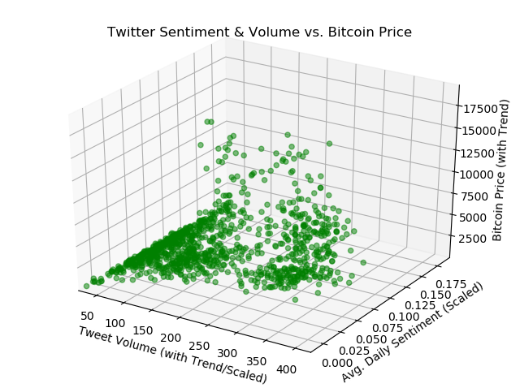
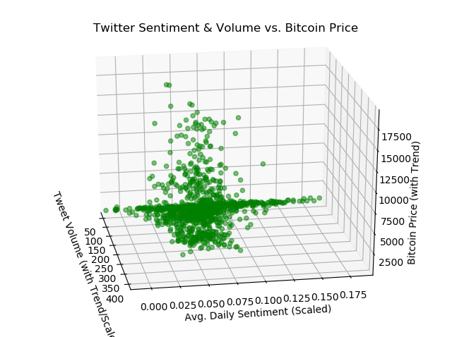
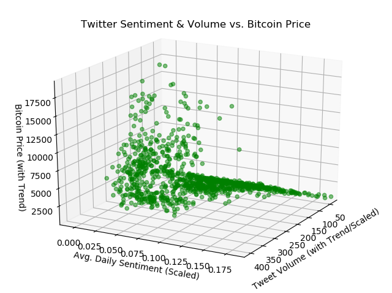
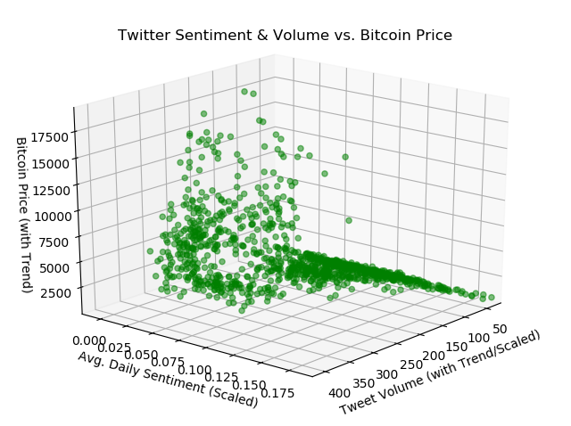
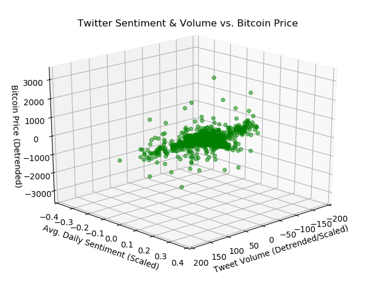
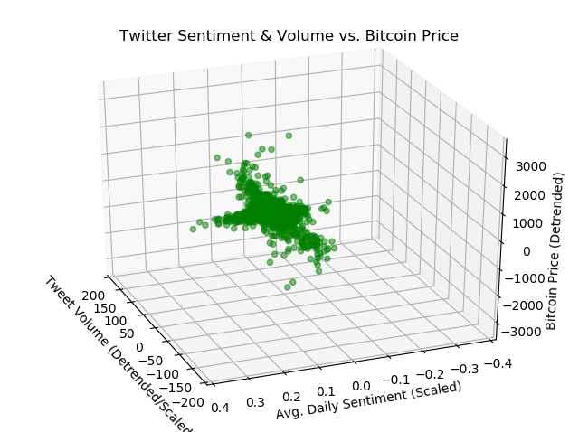
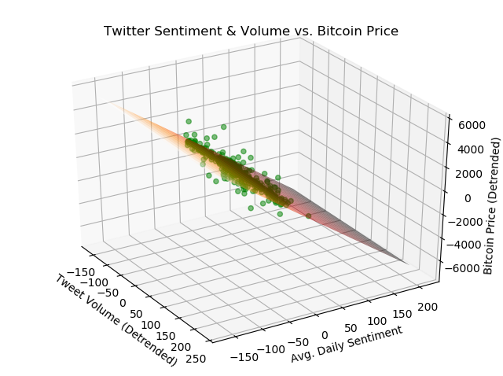

# Can Twitter sentiment predict Bitcoin performance?

[View full paper (PDF)](Can Twitter sentiment predict Bitcoin performance - Devon Ankar.pdf)

## Summary

Data analytics, quantitative finance, and algorithmic trading have brought the benefits of automation to the fingertips of everyday investors. An individual investor, such as a day trader, might want to use each day's Twitter sentiment to decide whether to buy, sell, or hold Bitcoin shares on that day itself. A day trader needs to know how to react to what has happened since the last day's close.

A number of online platforms let you build algorithms in the language of your choice and trade with real-time market data. As real-time trading is now highly accessible to individual investors, the author chose to approach this course project from the perspective of an individual investor (day trader) who wants to use each day's Twitter sentiment to decide whether to buy, sell, or hold Bitcoin shares on that day itself.

Bitcoin data was collected from Yahoo! Finance. Twitter data was collected from a random sample of 296,117 Tweet IDs which were "hydrated" to get full Tweet information. Sentiment analysis was performed on the Tweets using TextBlob. Models were developed using logistic regression, support vector machines, and random forest. All found that daily Twitter sentiment can be used to predict whether to buy, sell, or hold Bitcoin shares on a given day with an accuracy of over 85%. This result is mostly consistent with the literature.

However, the data is imbalanced, so 85% is approximately the baseline accuracy. In that context, the model is not very good. Please see full paper for more details on this and what was attempted to work around the imbalance.

**With trends** (both Twitter usage and Bitcoin prices have grown dramatically over the years examined): *Same plot with different perspective*

|------------|------------|------------|------------|
|  |  |  |  |

*(Click to enlargen)*

**Detrended:** *1 and 2 are the same*

|------|------|------|
|  |  |  |

## Results

Each model was run 100 times with the following results:

| MODEL ALGORITHM | PREDICTIVE ACCURACY - MEAN ± STANDARD DEV. |
|:--------------------------------|-----------------------------------------:|
| LOGISTIC REGRESSION | 0.855 ± 0.016 |
| SUPPORT VECTOR MACHINES | 0.854 ± 0.021 |
| RANDOM FOREST | 0.855 ± 0.018 |

Logistic regression had the highest performance with the highest predictive accuracy and lowest standard deviation. However, there was not much variance in the result between the three algorithms, and the small differences were not statistically significant. Random forest took the longest to run.

All models found that daily Twitter sentiment can be used to predict whether to buy, sell, or hold Bitcoin shares on a given day with an accuracy of over 85% (but recall the above caveat).

## Future Improvements

The model needs much improvement before it can be implemented as a real-world trading algorithm. The author hopes to ideally develop this model for real-world algorithmic trading in the quantitative finance space, using stock market data instead of Bitcoin data.

1. Historical stock market data will need to be obtained instead of Bitcoin data. Ideally, it would be good to get *hourly* stock market data instead of daily.

2. Broader collection of Tweets are needed for sentiment analysis. Also, look at other social media websites such as Reddit for additional comments for sentiment analysis.

3. Fix data imbalance issues and other data issues identified in the full report.

4. Develop safeguards for real-world trading, such as stop-loss conditions and protections against extreme or unpredictable occurrences.

5. Test extensively against real data without actually investing.

***

[View full paper (PDF)](Can Twitter sentiment predict Bitcoin performance - Devon Ankar.pdf)

***

**Tools Used:** Python - Pandas, Numpy, Sci-Kit Learn, TextBlob, Matplotlib

**Course:** DSE 6300 Data Science Apps and Development, Wayne State University

**Assignment:** Final Term Project

**Submitted:** Apr 26, 2019

***

**Last Updated:** May 1, 2019

***

[Back to MS in Data Science Coursework](/ms)